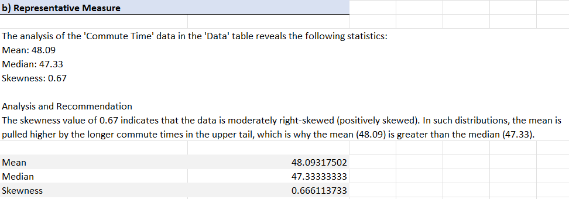
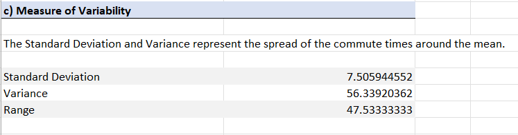
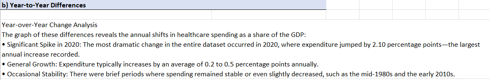

# Descriptive Statistics

**Chapters 1–2** — Describing distributions and categorical data (Albright 8e).

## Textbook datasets (`data/`)

| Problem | Dataset | Textbook reference |
|---------|---------|-------------------|
| 3 | `P02_03.xlsx` | Ch. 2, p. 50 |
| 6 | `P02_06.xlsx` | Ch. 2, p. 63 |
| 20 | `P02_20.xlsx` | Ch. 2, p. 70 |
| 36 | `Supermarket_Transactions.xlsx` | Ch. 2, p. 78 |

## Script

`solve_prob6.py` reads the datasets in `data/` and writes a formatted `Assignment_3_Answers.xlsx` using **pandas** and **xlsxwriter**.

## Visualizations

### Problem 3 — Categorical variables & column charts

### Problem 6 — Frequency distribution & histogram

### Problem 20 — Time series

### Problem 36 — Supermarket transactions

## Skills

Frequency tables, histograms, empirical rule, categorical recoding, Python Excel formatting
