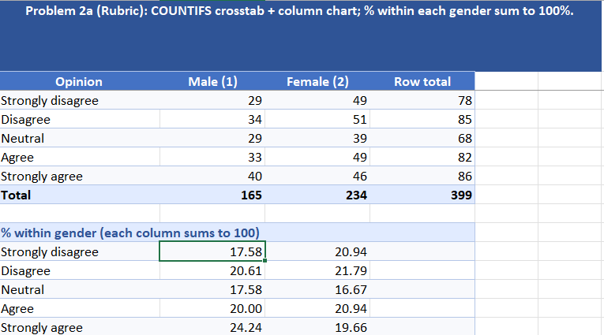
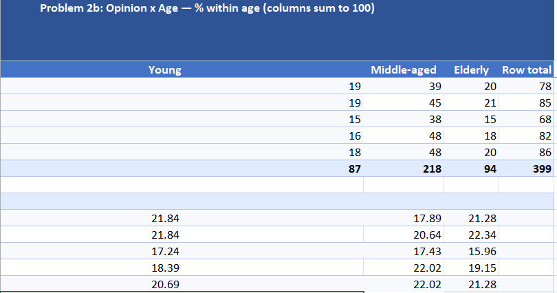
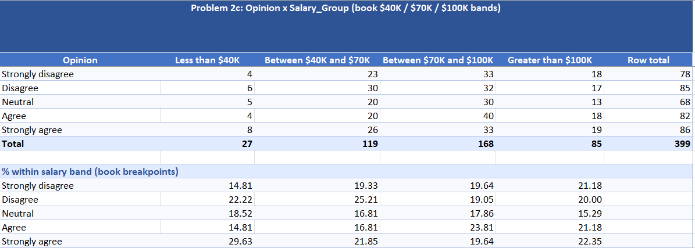
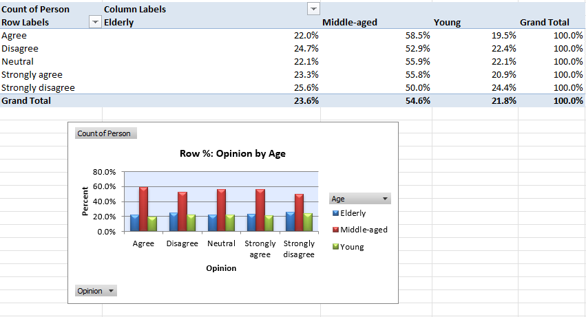

# Variable Relationships

**Chapter 3** — Relationships among variables (Albright 8e).

## Textbook datasets (`data/`)

| File | Problems | Textbook reference |
|------|----------|-------------------|
| `P03_02.xlsx` | 2, 34 | Ch. 3, pp. 90 & 125 |
| `P03_08.xlsx` | 8 | Ch. 3, p. 96 |
| `P03_21.xlsx` | 21 | Ch. 3, p. 104 |

## Scripts

```bash
python solve_assignment4.py
python _verify_assignment.py
```

## Visualizations

### Problem 2 — COUNTIFS crosstabs & column charts








### Problem 8 — Excel Table & summary statistics


### Problem 21 — Correlation & scatterplots


### Problem 34 — Pivot table crosstabs




## Skills

COUNTIFS, pivot tables, correlation, Excel Tables, Python/openpyxl automation
